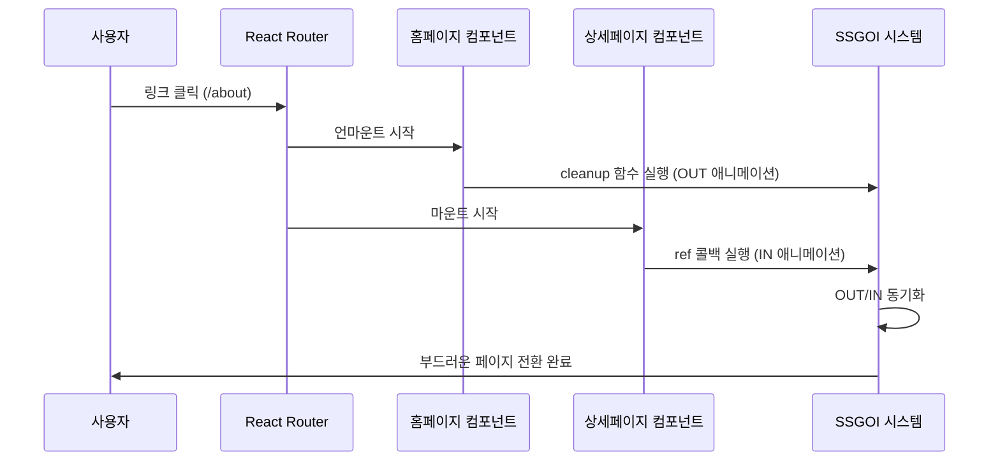

# SSGOI 페이지 전환 완전 플로우 가이드

React 페이지 전환에서 SSGOI 애니메이션이 실행되는 완전한 플로우를 최초 사용자 액션부터 `runEntrance` 실행까지 상세히 분석합니다.

---

## 🎬 전체 실행 시퀀스 개요



---

## 📋 단계별 상세 플로우

### **1단계: 사용자 액션 발생**

```jsx
// 사용자가 링크를 클릭하는 순간
<Link href="/about">상세페이지로 이동</Link>;
// 또는
router.push("/about");
// 또는 브라우저 뒤로가기/앞으로가기
```

**발생 시점**: `t = 0ms`  
**상태**: 현재 홈페이지(`/`) 표시 중

---

### **2단계: 라우터 변경 감지**

```typescript
// Next.js Router 또는 React Router가 경로 변경을 감지
// 내부적으로 발생하는 과정:

// 1. URL 변경 감지
window.history.pushState(null, "", "/about");

// 2. 라우터 상태 업데이트
router.pathname = "/about";
router.query = {};

// 3. 컴포넌트 교체 결정
// 기존: <HomePage /> → 새로운: <AboutPage />
```

**발생 시점**: `t = 1ms`  
**상태**: 라우터가 컴포넌트 교체 준비

---

### **3단계: 기존 컴포넌트 언마운트 시작**

```tsx
// 기존 홈페이지 컴포넌트 언마운트
const HomePage = () => {
    return (
        <SsgoiTransition id="/">
            <h1>홈페이지</h1>
            <ProductList />
        </SsgoiTransition>
    );
};

// React가 HomePage 컴포넌트를 DOM에서 제거 시작
// ↓
// SsgoiTransition의 ref 콜백이 null과 함께 호출됨
```

**발생 시점**: `t = 2ms`

#### **📍 언마운트 시 SSGOI cleanup 함수 실행**

```typescript
// createTransitionCallback에서 반환된 cleanup 함수 실행
return () => {
    const cloned = element.cloneNode(true) as HTMLElement; // 🔄 DOM 복사
    runExitTransition(cloned); // 🎬 OUT 애니메이션 시작
};
```

**핵심 포인트**:

- 원본 요소가 제거되기 전에 **복사본을 생성**
- 복사본으로 **OUT 애니메이션 실행**
- 원본은 이미 React에 의해 DOM에서 제거됨

---

### **4단계: runExitTransition 실행 (OUT 애니메이션)**

```typescript
const runExitTransition = async (element: HTMLElement) => {
    // 🎯 복사본을 currentClone으로 설정
    currentClone = element;

    // 📋 전환 설정 가져오기
    const transition = getTransition(); // { in: fade().in, out: fade().out }

    const configs: TransitionConfigs<TAnimationValue> = {
        in: transition.in && Promise.resolve(transition.in(element)),
        out: transition.out && Promise.resolve(transition.out(element)) // 🎬 OUT 설정
    };

    // 🎭 OUT 전략 실행
    const setup = await strategy.runOut(configs);
    if (!setup.config) return;

    setup.config.prepare?.(element);

    // 🔄 DOM에 복사본 삽입
    insertClone(); // parentRef.insertBefore(currentClone, nextSiblingRef)

    // 🎨 OUT 애니메이션 시작
    const animator = Animator.fromState(setup.state, {
        from: setup.from, // 1 (완전히 보임)
        to: setup.to, // 0 (완전히 숨김)
        spring: setup.config.spring,
        onUpdate: setup.config.tick, // fade out 효과
        onComplete: () => {
            // 애니메이션 완료 후 복사본 제거
            if (currentClone) {
                currentClone.remove();
                currentClone = null;
            }
            currentAnimation = null;
        }
    });

    currentAnimation = {animator, direction: "out"};
    animator.forward(); // 1 → 0 진행
};
```

**발생 시점**: `t = 2-3ms`  
**상태**: 홈페이지가 서서히 사라지기 시작

---

### **5단계: 새로운 컴포넌트 마운트 시작**

```tsx
// 새로운 상세페이지 컴포넌트 마운트
const AboutPage = () => {
    return (
        <SsgoiTransition id="/about">
            {" "}
            {/* ← 새로운 ID */}
            <h1>상세페이지</h1>
            <ProductDetail />
        </SsgoiTransition>
    );
};

// React가 새 컴포넌트를 DOM에 추가
```

**발생 시점**: `t = 3ms`

#### **📍 SsgoiTransition 컴포넌트 렌더링**

```tsx
// packages/react/src/lib/transition.tsx
export const SsgoiTransition = ({children, id}: SsgoiTransitionProps) => {
    const {getTransition} = useSsgoi(); // Context에서 전환 설정 가져오기

    return (
        <div
            ref={transition(getTransition(id))} // 🎯 핵심: transition() 호출
            data-ssgoi-transition={id}
        >
            {children}
        </div>
    );
};
```

---

### **6단계: transition() 함수 실행**

```typescript
// packages/core/src/lib/transition.ts
export function transition<TAnimationValue = number>(getTransition: () => Transition<undefined, TAnimationValue>): TransitionCallback {
    // 🏭 createTransitionCallback 호출하여 TransitionCallback 생성
    return createTransitionCallback(getTransition);
}
```

**발생 시점**: `t = 4ms`  
**반환값**: `TransitionCallback` 함수 (React ref 콜백용)

---

### **7단계: createTransitionCallback 실행**

```typescript
export function createTransitionCallback<TAnimationValue = number>(
  getTransition: () => Transition<undefined, TAnimationValue>,
  options?: { ... }
): TransitionCallback {

  // 🔧 상태 변수들 초기화
  let currentAnimation: { animator: Animator<TAnimationValue>; direction: "in" | "out" } | null = null;
  let currentClone: HTMLElement | null = null;
  let parentRef: Element | null = null;
  let nextSiblingRef: Element | null = null;

  // 🎭 Context와 Strategy 생성
  const context: StrategyContext<TAnimationValue> = {
    get currentAnimation() {
      return currentAnimation; // 🔄 동적 참조 (클로저)
    },
  };

  const strategy = options?.strategy?.(context) || createDefaultStrategy<TAnimationValue>(context);

  // 🎯 TransitionCallback 함수 반환
  return (element: HTMLElement | null) => {
    if (!element) return;

    // 📍 DOM 구조 정보 저장
    parentRef = element.parentElement;
    nextSiblingRef = element.nextElementSibling;

    // 🚀 IN 애니메이션 실행
    runEntrance(element);

    // 🧹 cleanup 함수 반환 (언마운트 시 호출)
    return () => {
      const cloned = element.cloneNode(true) as HTMLElement;
      runExitTransition(cloned);
    };
  };
}
```

**발생 시점**: `t = 4ms`  
**반환값**: 실제 ref 콜백 함수

---

### **8단계: React ref 콜백 실행**

```tsx
// React가 실제 DOM 요소를 생성한 후
<div ref={transitionCallback} data-ssgoi-transition="/about">
    <h1>상세페이지</h1>
    <ProductDetail />
</div>;

// React 내부 과정:
// 1. createElement('div')
// 2. appendChild(h1), appendChild(ProductDetail)
// 3. ref 콜백 호출
const actualDivElement = document.querySelector('[data-ssgoi-transition="/about"]');
transitionCallback(actualDivElement); // 🎯 실제 DOM 요소와 함께 호출
```

**발생 시점**: `t = 5ms`

#### **📍 TransitionCallback 함수 실행**

```typescript
return (element: HTMLElement | null) => {
    // element = 실제 <div> DOM 요소
    if (!element) return; // 실제 DOM이므로 통과

    // 📍 DOM 구조 정보 저장 (나중에 OUT 애니메이션에서 사용)
    parentRef = element.parentElement; // 상위 컨테이너
    nextSiblingRef = element.nextElementSibling; // 다음 형제 요소

    // 🎯 드디어 runEntrance 호출!
    runEntrance(element); // element = <div data-ssgoi-transition="/about">...</div>

    // 🧹 cleanup 함수 반환 (언마운트 시 OUT 애니메이션용)
    return () => {
        const cloned = element.cloneNode(true) as HTMLElement;
        runExitTransition(cloned);
    };
};
```

**발생 시점**: `t = 5ms`

---

### **🎯 9단계: runEntrance 함수 실행 (IN 애니메이션)**

```typescript
const runEntrance = async (element: HTMLElement) => {
    // 🧹 이전 OUT 애니메이션 복사본 정리
    if (currentClone) {
        currentClone.remove();
        currentClone = null;
    }

    // 📋 전환 설정 가져오기
    const transition = getTransition();
    // 실행 시점: 새 컴포넌트 마운트 완료 후
    // 반환값: { in: fade().in, out: fade().out }

    // 🎛️ 애니메이션 설정 생성
    const configs: TransitionConfigs<TAnimationValue> = {
        in: transition.in && Promise.resolve(transition.in(element)), // 🎬 IN 설정
        out: transition.out && Promise.resolve(transition.out(element)) // OUT 백업
    };

    // configs.in 실행 결과:
    // Promise<{ spring: { stiffness: 300, damping: 30 }, tick: (progress) => {...} }>

    // 🎭 전략에 따른 setup 생성
    const setup = await strategy.runIn(configs);
    // 가능한 시나리오:
    // 1. 애니메이션 없음 → 일반 IN 실행
    // 2. OUT 실행 중 → OUT 설정을 역방향으로 사용

    if (!setup.config) {
        return; // 설정이 없으면 애니메이션 없이 종료
    }

    // 🎬 애니메이션 준비
    setup.config.prepare?.(element); // 초기 스타일 설정 (opacity: 0 등)

    // 🎨 Animator 생성
    const animator = Animator.fromState(setup.state, {
        from: setup.from, // 0 (완전히 숨김)
        to: setup.to, // 1 (완전히 보임)
        spring: setup.config.spring, // { stiffness: 300, damping: 30 }
        onStart: setup.config.onStart, // 시작 콜백
        onUpdate: setup.config.tick, // 매 프레임마다 호출 → fade in 효과
        onComplete: () => {
            currentAnimation = null; // 애니메이션 완료 후 상태 정리
            setup.config?.onEnd?.(); // 종료 콜백 (cleanup 등)
        }
    });

    // 📝 현재 애니메이션 상태 저장
    currentAnimation = {animator, direction: "in"};

    // 🚀 애니메이션 시작!
    if (setup.direction === "forward") {
        animator.forward(); // 0 → 1 진행 (일반적인 IN)
    } else {
        animator.backward(); // 1 → 0 진행 (OUT 중단 후 역방향)
    }
};
```

**발생 시점**: `t = 5-6ms`  
**상태**: 상세페이지가 서서히 나타나기 시작

---

## ⏰ 타이밍 다이어그램

```
시간축: ←────────────────────────────────────────────────→
       0ms   1ms   2ms   3ms   4ms   5ms   6ms   ...   300ms

사용자:  🖱️ 클릭
        ↓
라우터:      🔄 변경감지
            ↓
홈페이지:         🔚 언마운트 → runExitTransition(복사본)
                    ↓
상세페이지:              🆕 마운트 → SsgoiTransition 렌더링
                          ↓
SSGOI:                      🎬 transition() → createTransitionCallback
                              ↓
React:                          📞 ref 콜백 → runEntrance(실제DOM)
                                  ↓
애니메이션:                           🎨 OUT/IN 동시 실행 ────────── 🏁 완료
```

---

## 🎯 핵심 포인트 정리

### **1. 비침투적 설계**

- 기존 React Router나 Next.js 라우터를 전혀 수정하지 않음
- ref 콜백과 cleanup 함수만으로 애니메이션 구현

### **2. DOM 클로닝 전략**

```typescript
// OUT 애니메이션: 원본이 제거되기 전에 복사본 생성
const cloned = element.cloneNode(true) as HTMLElement;
runExitTransition(cloned); // 복사본으로 OUT 애니메이션

// IN 애니메이션: 실제 DOM 요소로 애니메이션
runEntrance(actualElement); // 실제 요소로 IN 애니메이션
```

### **3. 메모리 관리**

```typescript
onComplete: () => {
    if (currentClone) {
        currentClone.remove(); // 🧹 OUT 애니메이션 완료 후 복사본 자동 제거
        currentClone = null;
    }
    currentAnimation = null; // 🧹 애니메이션 상태 정리
};
```

### **4. 상태 동기화**

- OUT과 IN 애니메이션이 서로의 존재를 인식
- `currentAnimation` 상태로 충돌 방지
- Strategy 패턴으로 복잡한 시나리오 처리

---

## 🔄 실제 코드 구조 분석

### **createTransitionCallback 핵심 구조**

```typescript
export function createTransitionCallback<TAnimationValue = number>(
    getTransition: () => Transition<undefined, TAnimationValue>,
    options?: {
        onCleanupEnd?: () => void;
        strategy?: (context: StrategyContext<TAnimationValue>) => TransitionStrategy<TAnimationValue>;
    }
): TransitionCallback {
    // 🔧 클로저 상태 변수들
    let currentAnimation: {animator: Animator<TAnimationValue>; direction: "in" | "out"} | null = null;
    let currentClone: HTMLElement | null = null;
    let parentRef: Element | null = null;
    let nextSiblingRef: Element | null = null;

    // 🎭 Strategy Pattern 구현
    const context: StrategyContext<TAnimationValue> = {
        get currentAnimation() {
            return currentAnimation; // 동적 참조
        }
    };

    const strategy = options?.strategy?.(context) || createDefaultStrategy<TAnimationValue>(context);

    // 🎬 IN 애니메이션 함수
    const runEntrance = async (element: HTMLElement) => {
        // 1. 이전 클론 정리
        // 2. 전환 설정 획득
        // 3. Strategy를 통한 setup 생성
        // 4. Animator 생성 및 실행
    };

    // 🎭 OUT 애니메이션 함수
    const runExitTransition = async (element: HTMLElement) => {
        // 1. 클론 설정
        // 2. DOM 삽입
        // 3. 애니메이션 실행
        // 4. 완료 후 정리
    };

    // 🎯 TransitionCallback 반환
    return (element: HTMLElement | null) => {
        if (!element) return;

        // DOM 구조 정보 저장
        parentRef = element.parentElement;
        nextSiblingRef = element.nextElementSibling;

        // IN 애니메이션 시작
        runEntrance(element);

        // cleanup 함수 반환
        return () => {
            const cloned = element.cloneNode(true) as HTMLElement;
            runExitTransition(cloned);
        };
    };
}
```

### **애니메이션 설정 플로우**

```typescript
// 1. getTransition() 호출
const transition = getTransition();
// 결과: { in: blur().in, out: blur().out }

// 2. configs 생성
const configs = {
  in: transition.in && Promise.resolve(transition.in(element)),
  out: transition.out && Promise.resolve(transition.out(element)),
};

// 3. blur().in(element) 실행 결과
configs.in resolves to: {
  spring: { stiffness: 300, damping: 30 },
  tick: (progress: number) => {
    const blurAmount = (1 - progress) * 10;
    element.style.filter = `blur(${blurAmount}px)`;
    element.style.opacity = progress.toString();
  }
}

// 4. strategy.runIn(configs) 실행
const setup = await strategy.runIn(configs);
// 결과: { config, state, from: 0, to: 1, direction: "forward" }

// 5. Animator.fromState() 호출
const animator = Animator.fromState(setup.state, {
  from: setup.from,           // 0
  to: setup.to,               // 1
  spring: setup.config.spring, // { stiffness: 300, damping: 30 }
  onUpdate: setup.config.tick, // blur 효과 함수
});
```

---

## 🚀 결론

SSGOI는 **React의 컴포넌트 라이프사이클을 활용**하여 **기존 라우팅 시스템에 비침투적으로 통합**되면서, **정교한 DOM 조작과 애니메이션 동기화**를 통해 네이티브 앱 수준의 부드러운 페이지 전환을 구현합니다.

핵심은 **ref 콜백의 정확한 타이밍 활용**과 **DOM 클로닝을 통한 연속적인 시각적 경험 제공**입니다. 이 모든 과정이 사용자가 링크를 클릭한 순간부터 불과 몇 밀리초 만에 자동으로 실행되어, 마치 하나의 연속된 화면처럼 느껴지는 전환 효과를 만들어냅니다.

### **SSGOI의 혁신적 특징**

1. **Zero Configuration**: 기존 라우터 수정 없음
2. **Memory Safe**: 자동 리소스 정리
3. **Performance Optimized**: 물리 기반 애니메이션
4. **Developer Friendly**: 직관적인 API
5. **Framework Agnostic**: React, Vue, Svelte 모두 지원

이러한 설계 덕분에 SSGOI는 복잡한 설정 없이도 **프로덕션 레디한 페이지 전환 솔루션**을 제공할 수 있습니다.
