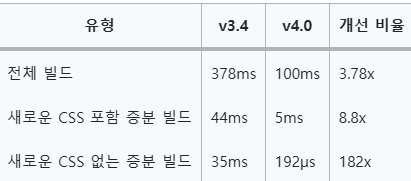
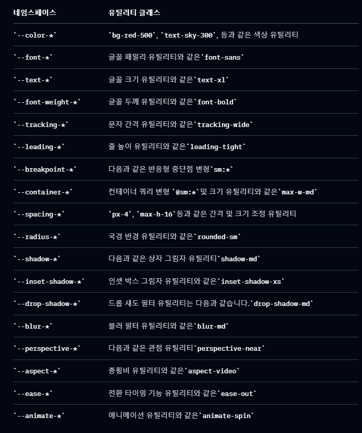

**테일윈드 CSS v4.0**

3.4 vs 4.0 버전의 차이 점  

## 1. 엔진 차이 ( 빌드 시간 축소 ) ##



## 2. 최신 css 기능 지원  ##
- 캐스케이드 레이어 지원 (@layer)   
기존 css 우선순위 !important > inline > id > class > tag > user-agent   
@layer reset, base, theme, components, utilities; 이렇게 선언 시   
reset > base > theme > components > utilities 순서 적용 가능   
- color-mix()   
이전에는 색은 섞으려면 sass나 js로 계산했지만, css로도 가능   
```css
    ex) background: color-mix(in srgb, blue 70%, white); // srgb, lab 색상 공간 ( 색을 계산하는 기준 )
```   
- CSS 커스텀 프로퍼티 등록 (@property)   
@property를 사용하면 타입, 초기값, 상속 여부를 정의할 수 있습니다.   

```css
    @property --rotation {
        syntax: "<angle>";
        inherits: false;
        initial-value: 0deg;
    }

    .box {
      transform: rotate(var(--rotation));
      transition: --rotation 1s;
    }

    .box:hover {
      --rotation: 180deg;
    }

```

-> 사용자 정의 변수를 애니메이션에 활용할 때 / cSS 변수에 타입 안정성을 주고 싶을 때   

- Logical Properties   
기존 CSS는 왼쪽(left), 오른쪽(right), 위(top), 아래(bottom) 방향 기반   
아랍어처럼 오른쪽에서 왼쪽으로 읽는 언어(RTL) 지원이 필요하면

```css 

/* 물리적 속성 */
margin-left: 20px;

/* 논리적 속성 */
margin-inline-start: 20px; /* 왼쪽(LTR) or 오른쪽(RTL) */
```   

- 내장 import 지원   
1. 이전 버전 (Tailwind CSS 3.x까지)   
@import를 사용하려면 postcss-import와 같은 외부 플러그인을 설치해야 했습니다.
플러그인 설정은 postcss.config.js에서 별도로 정의해야 했습니다.

```ts
    export default {
      plugins: [
        "postcss-import",
        "@tailwindcss/postcss",
      ],
    };
```   

2. 현재버전   
postcss-import 없이도 @import 디렉티브로 다른 CSS 파일을 포함할 수 있습니다.
Tailwind CSS 엔진에 직접 통합되어 성능이 더욱 최적화되었습니다.   

```ts
/* main.css */
@import "tailwindcss";
@import "./components/button.css";
@import "./components/card.css";
```   


## 3. 테마 관리 ##  
1. 기존 방식   
테마 변수를 설정파일에서 직접관리 (js)
```ts 
import plugin from "tailwindcss";

/** @type {import('tailwindcss').Config} */
export default {
    content: ["./index.html", "./src/**/*.{js,ts,jsx,tsx}"],
    mode: "jit",
    theme: {
        extend: {
            colors: {
                primary: "#0080DE",
                white: "#FFFFFF",
                navy: "#0C0B10",
                sub_navy: "#1F1E25",
                base_navy: "#0C0B10",
                green: "#009944",
                gray: "#242627",
                gray400: "#292829",
                gray300: "rgba(140,140,140,1)",
                gray200: "rgba(188,188,188,1)",
                gray100: "#D9D9D9",

                ...
```   

2. 최신버전   
css 파일에서 직접 설정 (Css-first) 접근 방식 도입   

```css
@import "tailwindcss";
@theme {
  --font-display: "Satoshi", "sans-serif";
  --font-pretendard: "Pretendard";
  --color-primary: "#0080DE";
  --color-gray400: "#292829";

  /* ... */
}
```  

이렇게 설정 하면 최종적으로 :root {} 로 변환   
***theme*** 을 최신 방식으로 사용 시 지켜야할 네임스페이스가 있음.   

   

## 4. 내장 import 지원 ##   
- 이전 버전 (Tailwind CSS 3.x까지)   
@import를 사용하려면 postcss-import와 같은 외부 플러그인을 설치해야 했습니다.   
플러그인 설정은 postcss.config.js에서 별도로 정의해야 했습니다.
```ts 
export default {
  plugins: [
    "postcss-import",
    "@tailwindcss/postcss",
  ],
};
```   

- 최신 버전   
@import 디렉티브로 다른 CSS 파일을 포함 가능   
Tailwind CSS 엔진에 직접 통합되어 성능이 더욱 최적화   

```css 
/* global.css */
@import "tailwindcss";
@import "./components/button.css";
@import "./components/card.css";
```

## 결론 ##

Tailwind CSS v4.0은 단순한 버전 업데이트를 넘어 **근본적인 패러다임 변화**를 가져왔습니다.

### 주요 변화 요약:
1. **성능 혁신**: 새로운 엔진으로 빌드 시간을 대폭 단축
2. **CSS-First 접근**: 설정 파일에서 CSS 파일로의 전환으로 더 직관적인 테마 관리
3. **최신 웹 표준 지원**: CSS 네이티브 기능들을 적극 활용
4. **개발자 경험 개선**: 내장 import 지원으로 외부 플러그인 의존성 감소

### 마이그레이션 고려사항:
- 기존 JS 기반 설정에서 CSS 기반 테마 설정으로의 전환 필요
- 네임스페이스 규칙 준수 (--color-, --font- 등)
- 일부 플러그인들의 호환성 확인 필요

**Tailwind CSS v4.0은 더 빠르고, 더 직관적이며, 웹 표준에 더 가까운 방향으로 진화했다고 평가할 수 있습니다.** 특히 CSS-First 접근 방식은 CSS 개발자들에게 더 친숙한 환경을 제공하며, 성능 최적화는 대규모 프로젝트에서 큰 이점이 될 것입니다.
