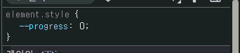

# 2주차 tailwindcss 4.1 사용 + 최신 css

## 1. 3.4.13 vs 4.1 기본차이

```css
/* 3.43
  @tailwind base;
  @tailwind components;
  @tailwind utilities;
*/

@import "tailwindcss";  /* base, components, utilities */
```

- base: 기본 스타일(Reset, Normalize 등)을 불러옵니다. (초기화 역할)
- components: 컴포넌트 스타일(예: 버튼, 폼 등)   
```css
@layer components {
  .btn-primary {
    @apply bg-blue-500 text-white px-4 py-2 rounded;
  }
}
```
 @layer: base, components, utilitie 알려주는 지시어    
 @apply: 여러 Tailwind 유틸리티 클래스를 한 번에 CSS 클래스에 적용할 수 있게 해주는 지시어     
 **결론은 위 btn-primary가 저러한 utilities 클래스를 통합해서 class로 쓰려면 @layer components로 감싸주어야함 ( 안 감쌀 시 css파일이 tailwindcss라는 걸 인식 못함 )**

- utilities: 유틸리티 클래스(예: p-4, text-center 등) 을 불러옵니다.


## 2. 테마 vs 직접 변수 사용
- 테마 사용 시 bg-primary   
- 변수 사용 시 bg-[var(--color-primary) > css 변수 직접 참조   


```ts
function ColorChanger() {
  const handleChangeColor = () => {
    // document.documentElement는 <html> 태그
    document.documentElement.style.setProperty('--color-primary', '#e11d48');  
    // 빨간색으로 변경
  };

  return (
    <div>
      <button onClick={handleChangeColor} className="p-2 border rounded">
        색상 바꾸기
      </button>
      <div className="bg-[var(--color-primary)] text-white p-4 mt-2 rounded">
        이 박스의 배경색이 바뀝니다!
      </div>
    </div>
  );
}
```   

## 3. group, data-state 예시   
data-state는 HTML 표준의 data-* 속성 중 하나   
- group  / group-data (4.1에서 강화)   


동작 원리
- 부모에 group 클래스가 있으면, 자식에서 group-data-[state=open]:스타일을 쓸 수 있음   
- 부모의 data-state 값이 open일 때만 해당 스타일이 적용됨

```ts
export const ListItems = () => {
    const {setSelectedMenuItem, selectedMenuItem} = useContext(GlobalContext);

    const handleClick = (item: string) => {
        if (item === selectedMenuItem) {
            setSelectedMenuItem(null);
            return;
        }

        setSelectedMenuItem(item);
    };

    const selectedItemStyle = (item: string) => {
        return item === selectedMenuItem
            ? "font-bold text-primary underline"
            : "";
    };

    const groupState = selectedMenuItem ? "open" : "closed";

    return (
        // groupState의 값이 open이 되면 하위 자식들 모두 group-data-[state=open]:bg-[rgba(0,0,0,0.99)]
        // group class지정을 했기때문에 ul에 hover 시 자식 들 전부 group-hover:bg-[rgba(0,0,0,0.1)]
        <ul data-state={groupState} className="group flex items-start flex-col gap-6 w-full">
            {ITEM_LIST.map((item) => (
                <li
                    key={item.id}
                    className={`group-data-[state=open]:bg-[rgba(0,0,0,0.99)] group-hover:bg-[rgba(0,0,0,0.1)] ${selectedItemStyle(
                        item.text
                    )} cursor-pointer transition-all`}
                    onClick={() => handleClick(item.text)}
                >
                    {item.text}
                </li>
            ))}
        </ul>
    );
};

```

## 4. @property이용해서 ProgressBar 구현


```css
@property --progress {
  syntax: '<number>';
  inherits: false;
  initial-value: 0;
}
```

```ts
// mainContents
const handleScroll = () => {
    if (mainRef.current) {
        const { scrollTop, scrollHeight, clientHeight } = mainRef.current;
        const scrolled = (scrollTop / (scrollHeight - clientHeight)) * 100;
        setScrollY(scrolled);
    }
};

<main onScroll={handleScroll} ref={mainRef} className="h-full w-full bg-white overflow-y-auto p-4">
    <ProgressBar progress={scrollY} />
    {renderContent()}
</main>
```


```ts
export const ProgressBar = ({progress}: ProgressBarProps) => {
    return (
        <div className="w-full bg-[#F5F7F8] rounded-2 h-2 overflow-hidden fixed top-0 left-0">
            <div
                className="bg-primary h-full transition-all duration-300 w-[calc(var(--progress,0)*1%)]"
                style={{"--progress": progress} as React.CSSProperties}
            ></div>
        </div>
    );
};
```   
- **--progress / width 동적 변화 감지**     
   

## 슈퍼이슈
지원 브라우저:
Chrome 114 이상   
Edge 114 이상   
Firefox 113 이상   
Safari 16.4 이상   

지원하지 않는 브라우저   
Internet Explorer 전면 미지원
구버전 브라우저(ESM, CSS 최신 기능 미지원 브라우저) 미지원

## 결론
이번 2주차에서는 Tailwind CSS 4.1의 주요 변화와 실제 사용법, 그리고 최신 CSS 문법을 활용한 커스텀 방법까지 다뤄보았습니다.  
특히, `@layer`, `@apply`와 같은 Tailwind 전용 기능과 표준 CSS의 `@property`를 함께 사용하면서,  
더 유연하고 확장성 있는 스타일링이 가능해졌음을 경험할 수 있었습니다.

https://www.reddit.com/r/tailwindcss/comments/1jwtg4y/are_people_shifting_to_tailwindcss_v4/?tl=ko   

허나 위 레딧에서 볼 수 있듯이 tailwind css 4.1 버전은 구형 브라우저에 지원이 안되는게 많기 때문에,, 무작정 마이그레이션 했다가는 사용하지 못할 유저가 생길겁니다.