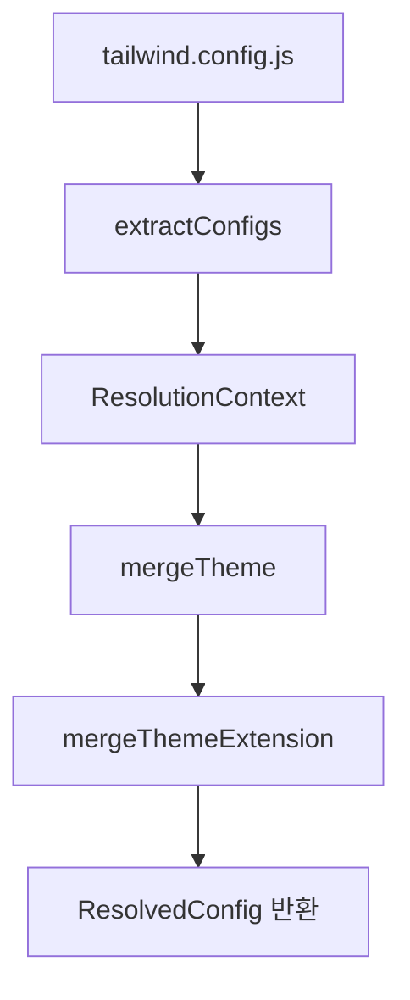

## 🧩 Tailwind CSS의 설정 해석 구조: `resolveConfig.ts` 분석

> Tailwind CSS v4 (main branch)의 핵심 구성 요소인 `resolveConfig.ts`는
> 사용자 설정(`tailwind.config.js`)을 Tailwind 내부의 디자인 시스템(`DesignSystem`) 기반으로
> 통합·정규화된 설정(`ResolvedConfig`)으로 변환하는 모듈입니다.
> 이 파일은 **테마 병합, 플러그인 확장, content 파일 경로 통합, 다단계 preset 해석**의 중심입니다.

---

### 🧱 1. 파일의 역할

📌 **역할:**

* 여러 개의 `tailwind.config.js`, preset, plugin 설정을 **하나의 최종 config**로 합침
* `theme`, `content`, `plugins` 정보를 통합
* `extend` 옵션을 처리해 테마 확장 기능 지원

---

### 🧩 2. 최상단 구조 개요

```ts
import type { DesignSystem } from '../../design-system'
import type { SourceLocation } from '../../source-maps/source'
import colors from '../colors'
import type { PluginWithConfig } from '../plugin-api'
import { createThemeFn } from '../plugin-functions'
import { deepMerge, isPlainObject } from './deep-merge'
```

🔍 **핵심 포인트**

* Tailwind 4는 `DesignSystem`이라는 추상 계층을 도입해, **테마·플러그인 해석을 공통 인터페이스**로 처리.
* `deepMerge`는 여러 설정을 병합할 때 재귀적으로 병합하는 유틸리티.
* `createThemeFn`은 `theme()` 함수의 런타임 동작을 정의하는 팩토리.

---

### ⚙️ 3. `resolveConfig()` 함수의 전체 구조

```ts
export function resolveConfig(
  design: DesignSystem,
  files: ConfigFile[],
): { resolvedConfig: ResolvedConfig; replacedThemeKeys: Set<string> } {
  let ctx: ResolutionContext = {
    design,
    configs: [],
    plugins: [],
    content: { files: [] },
    theme: {},
    extend: {},
    result: structuredClone(minimal),
  }

  for (let file of files) {
    extractConfigs(ctx, file)
  }

  for (let config of ctx.configs) {
    if ('darkMode' in config) ctx.result.darkMode = config.darkMode ?? null
    if ('prefix' in config) ctx.result.prefix = config.prefix ?? ''
    if ('blocklist' in config) ctx.result.blocklist = config.blocklist ?? []
    if ('important' in config) ctx.result.important = config.important ?? false
  }

  let replacedThemeKeys = mergeTheme(ctx)

  return {
    resolvedConfig: {
      ...ctx.result,
      content: ctx.content,
      theme: ctx.theme as ResolvedConfig['theme'],
      plugins: ctx.plugins,
    },
    replacedThemeKeys,
  }
}
```

---

### 🧠 단계별 동작 분석

#### 🪄 1️⃣ **ResolutionContext 초기화**

```ts
let ctx: ResolutionContext = { ... }
```

* Tailwind 내부에서 설정을 누적 저장할 “컨텍스트 객체”
* 다음 항목 포함:

  * `design`: Tailwind의 디자인 시스템 인터페이스
  * `configs`: 사용자 및 preset의 모든 설정 객체 리스트
  * `plugins`: 플러그인 리스트
  * `theme`: 누적된 테마
  * `extend`: 테마 확장용 key-value 쌍
  * `result`: 최종 config의 기본 뼈대

---

#### 🧩 2️⃣ **extractConfigs()**

```ts
for (let file of files) {
  extractConfigs(ctx, file)
}
```

이 함수는 Tailwind 설정 파일, preset, 플러그인을 **모두 순회하며 통합**합니다.

```ts
function extractConfigs(ctx: ResolutionContext, { config, base, path, reference, src }: ConfigFile) {
  // 1. 플러그인 정규화
  // 2. preset 재귀 병합
  // 3. content 경로 통합
  // 4. theme/variants 병합 리스트 추가
}
```

📘 **핵심 로직**

* `plugin.withOptions()` 형태의 플러그인도 모두 `PluginWithConfig` 형태로 정규화
* `config.presets`가 있으면 **재귀적으로** 다시 `extractConfigs` 호출
* `content` 배열을 순회하면서 파일 경로를 누적
* 모든 config는 `ctx.configs.push(config)`로 등록되어 이후 병합됨

---

#### 🎨 3️⃣ **Top-level Key 병합**

```ts
for (let config of ctx.configs) {
  if ('darkMode' in config) ctx.result.darkMode = config.darkMode ?? null
  ...
}
```

* `darkMode`, `prefix`, `important`, `blocklist` 등의 단일 속성은 **마지막 설정 우선으로 병합**됩니다.

---

#### 🧬 4️⃣ **mergeTheme()로 테마 통합**

이 함수는 가장 복잡하면서도 핵심입니다.

```ts
function mergeTheme(ctx: ResolutionContext): Set<string> {
  let replacedThemeKeys: Set<string> = new Set()
  let themeFn = createThemeFn(ctx.design, () => ctx.theme, resolveValue)
  let theme = Object.assign(themeFn, { theme: themeFn, colors })

  for (let config of ctx.configs) {
    let theme = config.theme ?? {}
    let extend = theme.extend ?? {}

    // 기존 테마 키 중 새로 정의된 것 추적
    for (let key in theme) if (key !== 'extend') replacedThemeKeys.add(key)
    Object.assign(ctx.theme, theme)

    // extend 병합 준비
    for (let key in extend) {
      ctx.extend[key] ??= []
      ctx.extend[key].push(extend[key])
    }
  }

  // extend 내용 실제 반영
  for (let key in ctx.extend) {
    let values = [ctx.theme[key], ...ctx.extend[key]]
    ctx.theme[key] = () => {
      let v = values.map(resolveValue)
      return deepMerge({}, v, mergeThemeExtension)
    }
  }

  for (let key in ctx.theme) {
    ctx.theme[key] = resolveValue(ctx.theme[key])
  }

  return replacedThemeKeys
}
```

📌 **핵심 포인트 요약**

| 역할                  | 설명                                                          |
| ------------------- | ----------------------------------------------------------- |
| `createThemeFn`     | `theme()` 헬퍼 생성. 플러그인에서 `theme('colors.red.500')` 호출 가능하게 함 |
| `replacedThemeKeys` | 유저가 재정의한 테마 키 추적용                                           |
| `extend` 처리         | 기존 테마 위에 `extend` 항목 병합 (예: `theme.extend.colors`)          |
| `deepMerge`         | `mergeThemeExtension` 규칙 기반으로 중첩된 객체 병합                     |

---

#### 🔄 5️⃣ **mergeThemeExtension()**

```ts
export function mergeThemeExtension(themeValue, extensionValue) {
  if (Array.isArray(themeValue) && isPlainObject(themeValue[0])) {
    return themeValue.concat(extensionValue)
  }
  if (Array.isArray(extensionValue) && isPlainObject(extensionValue[0]) && isPlainObject(themeValue)) {
    return [themeValue, ...extensionValue]
  }
  if (Array.isArray(extensionValue)) {
    return extensionValue
  }
  return undefined
}
```

🧩 **이 함수의 역할:**
테마 확장을 단순 덮어쓰기하지 않고 **데이터 구조에 따라 다른 방식으로 병합**
예를 들어:

```js
theme: {
  fontFamily: {
    sans: ['ui-sans-serif'],
  },
  extend: {
    fontFamily: {
      sans: ['Inter', 'Roboto'],
    },
  },
}
```

→ 결과:

```js
fontFamily.sans = ['ui-sans-serif', 'Inter', 'Roboto']
```

---

### 🧭 6️⃣ 최종 반환 구조

```ts
return {
  resolvedConfig: {
    ...ctx.result,
    content: ctx.content,
    theme: ctx.theme,
    plugins: ctx.plugins,
  },
  replacedThemeKeys,
}
```

결과적으로 Tailwind는

* **모든 설정, preset, 플러그인을 병합**
* `theme`와 `extend`를 합쳐 **최종 디자인 토큰 세트** 생성
* `resolvedConfig`로 반환하여 나중에 빌드 단계에서 참조

---

### 📊 요약 다이어그램



---

### 🧠 정리

| 개념                      | 역할                     |
| ----------------------- | ---------------------- |
| `ResolutionContext`     | 설정 병합을 위한 상태 컨테이너      |
| `extractConfigs()`      | 플러그인·preset·content 통합 |
| `mergeTheme()`          | 테마 및 확장 병합             |
| `mergeThemeExtension()` | 배열/객체 단위로 병합 규칙 정의     |
| `resolveConfig()`       | 모든 과정을 실행해 최종 설정 반환    |

---
