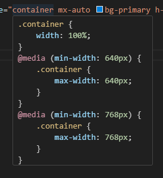
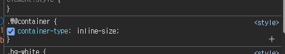

## 📍해당 작업은 tailwindCSS 3버전 기준으로 작성하였습니다.   

✔️ 주요 개념 정리   
### @apply
- 여러 Tailwind 유틸리티 클래스를 한 번에 기존/커스텀 CSS 클래스에 적용할 수 있게 해주는 Tailwind 전용 지시어입니다.   
- 반복되는 Tailwind 클래스를 묶어서 재사용할 때 유용합니다.

### utilities
- Tailwind의 유틸리티 레이어를 의미합니다.
- @layer utilities { ... }로 감싸면, 해당 스타일이 유틸리티 클래스처럼 동작합니다.
- 보통 한두 개 속성만 가진, 조합해서 쓰는 작은 단위의 스타일을 정의할 때 사용합니다.

### @layer
- Tailwind CSS에서 스타일의 적용 영역을 지정하는 지시어입니다.
- base, components, utilities 세 가지 레이어가 있습니다.
- 예시:
- @layer base { ... } : 기본 스타일(리셋 등)
- @layer components { ... } : 재사용 컴포넌트 스타일
- @layer utilities { ... } : 유틸리티 클래스(작은 단위 스타일)


## 1. :is() & :where()
- Tailwind 클래스만으로는 :is, :where 같은 selector를 직접 지원하지 않습니다.   
- 글로벌 CSS나 @layer로 커스텀 CSS를 추가해서 사용하면 됩니다.   
- 대부분 이렇게 처리 가능합니다.

```css
@layer components {
    :is(.white-btn) {
        @apply bg-white;
    }

    :where(.btn-2) {
        @apply bg-blue-500;
    }
}
```
```html
<button className="white-btn">1</button>
<button className="btn-2">2</button>
<button className="white-btn">3</button>
```   


## 2. 컨테이너 쿼리
- TailwindCSS 4버전부터 컨테이너 쿼리를 지원합니다...
- TailwindCSs 3버전에서는 플러그인을 설치하여 사용해야 합니다.
- 그렇지만 비슷한 기능은 사용 가능합니다.

```ts
// container 추가
<div className="container mx-auto bg-primary h-[300px]"></div>
```

   

- container 클래스를 추가하면, 해당 요소가 컨테이너가 되고 tailwind에서 자동으로 반응형 스타일이 적용됩니다.   
- 이때 반응형은 컨테이너 너비가 아닌 뷰포트 너비에 따라 결정됩니다. (media query 적용)   
   


## 2.1 3버전 컨테이너 쿼리를 위한 플러그인 적용
**1. 플러그인 설치**
```
npm install -D @tailwindcss/container-queries
```

**2. tailwind.config.js에 플러그인 추가**
```ts
// tailwind.config.js
module.exports = {
  theme: {
    // ...
  },
  plugins: [
    require('@tailwindcss/container-queries'),
    // ...
  ],
}
```


**3. 사용법**
```html
// 컨테이너 쿼리 적용 예시, 자식 2개의 비교
<div className="@container bg-white h-[300px]">
    <div className="@lg:bg-primary @sm:bg-red-500 h-1/2"></div>
    <div className="bg-white h-1/2"></div>
</div>
```   

- @container 클래스를 추가한 요소가 컨테이너가 됩니다.   
- 자식 요소에 @sm, @md, @lg 등으로 컨테이너 너비에 따른 반응형 스타일을 지정할 수 있습니다.

**4. 예시**   
- 부모   
   
- 자식   
   

- 자식 요소가 부모 컨테이너 너비에 따라 배경색이 바뀌는 것을 확인할 수 있습니다.   
- TailwindCSS 3버전에서 플러그인을 사용하여 컨테이너 쿼리를 적용하는 방법을 알아보았습니다.   

**5. Configuration**   
- 플러그인에서 제공하는 컨테이너 쿼리 브레이크포인트는 다음과 같습니다.   

| 이름  | CSS                                      |
|-------|------------------------------------------|
| @xs   | @container (min-width: 20rem /* 320px */) |
| @sm   | @container (min-width: 24rem /* 384px */) |
| @md   | @container (min-width: 28rem /* 448px */) |
| @lg   | @container (min-width: 32rem /* 512px */) |
| @xl   | @container (min-width: 36rem /* 576px */) |
| @2xl  | @container (min-width: 42rem /* 672px */) |
| @3xl  | @container (min-width: 48rem /* 768px */) |
| @4xl  | @container (min-width: 56rem /* 896px */) |
| @5xl  | @container (min-width: 64rem /* 1024px */)|
| @6xl  | @container (min-width: 72rem /* 1152px */)|
| @7xl  | @container (min-width: 80rem /* 1280px */)|   

6. 참고 링크
- [TailwindCSS Container Queries 플러그인 공식 문서](https://github.com/tailwindlabs/tailwindcss-container-queries)   


## 3. 플러그인 값 구성   
- TailwindCSS에서 제공하지 않는 CSS 속성을 플러그인으로 추가할 수 있습니다.   
- 예시: text-shadow 속성 추가

```ts
import plugin from "tailwindcss/plugin";

// tailwind.config.js
export default {
    content: ["./index.html", "./src/**/*.{js,ts,jsx,tsx}"],
    mode: "jit",
    plugins: [
        plugin(function ({matchUtilities, theme}) {
            matchUtilities(
                {
                    "text-shadow": v => ({
                        textShadow: v,
                    }),
                },
                {values: theme("textShadow")},
            );
        }),
    ],
}
```


1. plugin(function ({matchUtilities, theme}) { ... }) 활용    
- Tailwind CSS에서 커스텀 유틸리티를 만들 때 사용하는 플러그인 패턴입니다.   

2. matchUtilities로 유틸리티 클래스 정의   
- 첫 번째 인자: 유틸리티 이름과 스타일 매핑   
```ts
{
    "text-shadow": v => ({ // 유틸리티 만들고 v라는 값을 받아서
        textShadow: v, // css 생성
    }),
}  
``` 
→ "text-shadow"라는 유틸리티를 만들고   
→ 값(v)을 받아서 { textShadow: v }로 CSS를 생성합니다.   
- 두 번째 인자: 사용할 값의 집합   
```ts
{values: theme("textShadow")},
```
→ tailwind.config.ts의 theme.extend.textShadow에 정의된 값들을 사용합니다.   

3. 사용예시   
```ts
export default {
    content: ["./index.html", "./src/**/*.{js,ts,jsx,tsx}"],
    mode: "jit",
    theme: {
        extend: {
            textShadow: {
                custom_shadow: "0 4px 0 rgba(0, 0, 0, .4)",
            },
        },
    },
    plugins: [
        plugin(function ({matchUtilities, theme}) {
            matchUtilities(
                {
                    "text-shadow": v => ({
                        textShadow: v,
                    }),
                },
                {values: theme("textShadow")},
            );
        }),
        require("@tailwindcss/container-queries"),
    ],
};
```
```html
<div className="bg-white h-1/2 text-shadow-custom_shadow">123123</div>
```
- theme.extend.textShadow에 custom_shadow 값을 추가하였습니다.   
- 플러그인에서 text-shadow 유틸리티를 정의하였습니다.
- 실제 사용 시 text-shadow-custom_shadow 클래스를 사용하여 텍스트 그림자를 적용할 수 있습니다.   

4. 번외 (그냥 적용 하려면)   
```html
<div className="bg-white h-1/2 [text-shadow:_0_4px_4px_rgb(99_102_241_/_0.8)]">123123</div>   
```  
- 굳이 플러그인을 만들지 않고, 그냥 바로 적용하려면 위와 같이 대괄호 표기법을 사용하여 인라인으로 CSS 속성을 지정할 수도 있습니다. (그치만 굉장히 지저분해짐)


## 4. 마무리
- TailwindCSS 3버전에서 :is, :where 같은 selector 적용법과 컨테이너 쿼리 플러그인 사용법, 플러그인 값 구성 방법에 대해 알아보았습니다.   
- 추후 프로젝트에서는 TailwindCSS 4버전을 사용하는 것을 추천드립니다.
- TailwindCSS 4버전에서는 컨테이너 쿼리와 text-shadow가 기본 지원되므로, **4버전 사용을 권장**드립니다. ^_^
  

